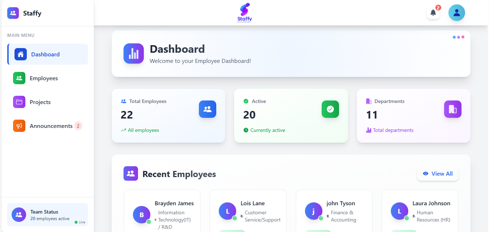

# React + Vite

This template provides a minimal setup to get React working in Vite with HMR and some ESLint rules.
Currently, two official plugins are available:

- [@vitejs/plugin-react](https://github.com/vitejs/vite-plugin-react/blob/main/packages/plugin-react) uses [Babel](https://babeljs.io/) for Fast Refresh
- [@vitejs/plugin-react-swc](https://github.com/vitejs/vite-plugin-react/blob/main/packages/plugin-react-swc) uses [SWC](https://swc.rs/) for Fast Refresh

## Expanding the ESLint configuration

If you are developing a production application, we recommend using TypeScript with type-aware lint rules enabled. Check out the [TS template](https://github.com/vitejs/vite/tree/main/packages/create-vite/template-react-ts) for information on how to integrate TypeScript and [`typescript-eslint`](https://typescript-eslint.io) in your project.

# Employee Dashboard App

<div align="center">
  
  <h1>Staffy - Modern Employee Dashboard</h1>
  <p>
    A comprehensive employee management system with real-time updates, role-based access control, and beautiful UI.
  </p>
  
  [](https://reactjs.org/)
  [](https://firebase.google.com/)
  [](https://vitejs.dev/)
  [](https://tailwindcss.com/)
  [](https://opensource.org/licenses/MIT)
</div>

## Features

### Core Functionality

- Secure Authentication & Authorization
- Employee Profile Management
- Real-time Dashboard Analytics
- Announcements & Notifications
- Project Management
- Social Media Integration
- Fully Responsive Design

### Security

- Role-based Access Control (RBAC)
- Email/Password Authentication
- Protected Routes
- Secure API Endpoints

## Tech Stack

### Frontend

- **React 18** - UI Library
- **Vite** - Build Tool
- **Tailwind CSS** - Styling
- **React Router** - Navigation
- **React Icons** - Icon Library
- **React Hot Toast** - Notifications

### Backend

- **Firebase Authentication** - User Management
- **Firestore** - Real-time Database
- **Firebase Storage** - File Storage
- **Firebase Hosting** - Deployment

## Getting Started

### Prerequisites

- Node.js 16+ & npm/yarn
- Firebase account
- Git

### Installation

1. **Clone the repository**

   ```bash
   git clone https://github.com/yourusername/staffy.git
   cd staffy
   ```

2. **Install dependencies**

   ```bash
   npm install
   # or
   yarn
   ```

3. **Set up environment variables**
   Create a `.env` file in the root directory:

   ```env
   VITE_FIREBASE_API_KEY=your_api_key
   VITE_FIREBASE_AUTH_DOMAIN=your_auth_domain
   VITE_FIREBASE_PROJECT_ID=your_project_id
   VITE_FIREBASE_STORAGE_BUCKET=your_storage_bucket
   VITE_FIREBASE_MESSAGING_SENDER_ID=your_sender_id
   VITE_FIREBASE_APP_ID=your_app_id
   VITE_IMGBB_API_KEY=your_imgbb_key
   ```

4. **Start the development server**
   ```bash
   npm run dev
   # or
   yarn dev
   ```
   The app will be available at `http://localhost:5173`

## Project Structure

```
staffy/
├── public/               # Static files
├── src/
│   ├── assets/           # Images, fonts, etc.
│   ├── components/       # Reusable UI components
│   │   ├── auth/         # Authentication components
│   │   ├── employees/    # Employee management components
│   │   ├── layout/       # Layout components
│   │   └── ui/           # UI components
│   ├── config/           # Configuration files
│   ├── context/          # React context providers
│   ├── hooks/            # Custom React hooks
│   ├── pages/            # Page components
│   │   ├── announcements/
│   │   ├── auth/
│   │   ├── dashboard/
│   │   ├── employees/
│   │   └── projects/
│   ├── services/         # API and service integrations
│   ├── styles/           # Global styles
│   ├── utils/            # Utility functions
│   ├── App.jsx           # Main App component
│   ├── main.jsx          # Entry point
│   └── routes.jsx        # Application routes
├── .env.example          # Example environment variables
├── package.json
└── vercel.json           # Vercel configuration
```

## Deployment

### Vercel (Recommended)

1. Install Vercel CLI (if not installed)

   ```bash
   npm install -g vercel
   ```

2. Deploy to Vercel
   ```bash
   vercel login
   vercel
   ```

### Firebase Hosting

1. Install Firebase CLI

   ```bash
   npm install -g firebase-tools
   firebase login
   ```

2. Build the project

   ```bash
   npm run build
   ```

3. Deploy to Firebase
   ```bash
   firebase init
   firebase deploy
   ```

## Contributing

1. Fork the Project
2. Create your Feature Branch (`git checkout -b feature/AmazingFeature`)
3. Commit your Changes (`git commit -m 'Add some AmazingFeature'`)
4. Push to the Branch (`git push origin feature/AmazingFeature`)
5. Open a Pull Request

## License

Distributed under the MIT License. See `LICENSE` for more information.

## Contact

Ali Mohamed - [@your_twitter](https://twitter.com/your_twitter) - ali.dev400@gmail.com

Project Link: [https://github.com/yourusername/staffy](https://github.com/yourusername/staffy)

## Acknowledgements

- [React](https://reactjs.org/)
- [Firebase](https://firebase.google.com/)
- [Vite](https://vitejs.dev/)
- [Tailwind CSS](https://tailwindcss.com/)
- [React Icons](https://react-icons.github.io/react-icons/)
  .
